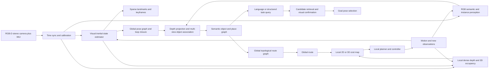

# 单 RGB-D 双目相机 + IMU 的语义世界稀疏三维建模与导航方案

版本：0.2（概念设计、原型实施与验证基线）

## 摘要

本方案将目标定义为：使用一个带 IMU 的 RGB-D 双目深度相机，在室内环境中增量建立“可定位、可检索、可规划、可更新”的语义世界模型。核心结论是，不应把整个系统压缩成一种永久稠密点云或一张二维地图，而应采用四层表示，并把长期稀疏信息与短期稠密信息严格分离：

1. **度量定位层**：视觉-惯性 RGB-D SLAM，维护关键帧、稀疏稳定特征、局部 odom 与全局 map 位姿图。
2. **语义对象层**：把二维实例/语义分割与深度、全局位姿融合成对象节点，保存类别候选、属性、几何、观测证据、截图和置信度。
3. **通行拓扑层**：以房间、走廊、门口、楼梯、电梯和局部航路点为节点，以具有条件和代价的连通关系为边。
4. **实时安全层**：由当前 RGB-D 数据生成局部 2D/3D obstacle/cost map，处理临时障碍、未知空间和动态物体；它是短生命周期缓存，不是长期世界模型主体。

这四层分别回答“我在哪里”“那里有什么”“大体怎么走”“眼前现在能不能走”。它们共享坐标系和时间戳，但不互相替代。长期保存的是稀疏地标、语义对象/地点、通行拓扑和少量证据图；高密度局部点云仅在运行时保存。用户命令“去找红色的水杯”先在语义对象层检索候选，再使用当前观测确认对象和目标点，最后在通行拓扑层做全局路线、在局部安全层做实时避障。

## 1. 边界与可实现性判断

### 1.1 可以实现的目标

在环境具有足够纹理、光照可用、相机标定正确、机器人运动不过快且地图范围适中的条件下，单 RGB-D 双目 + IMU 可以实现：

- 建立以首次启动位置或用户指定位置为原点的室内 map 坐标系；
- 通过视觉特征、深度几何、IMU 和回环约束估计相机在 map 中的 6DoF 位姿；
- 生成稀疏几何地标、关键帧和概率式占据地图；
- 通过二维实例分割/开放词汇检测和深度投影建立对象级语义地图；
- 在多楼层场景中用 floor_id、z 高程和楼梯/电梯边连接多个平面地图；
- 将文本或结构化任务转换为语义检索、候选确认、路径规划和执行反馈。

### 1.2 不能仅凭这套传感器保证的目标

- **与地球或建筑 CAD 对齐的绝对坐标**：没有 GNSS、全站仪、已知基准点、无线定位或人为测量，地图只能是“地图内全局坐标”；原点可以人为定义，但原点的现实世界经纬度/建筑坐标没有物理来源。
- **永不漂移的全局位姿**：每一步相对运动都很准，长时间串联仍会积累误差；必须依赖稳定地标、重复观测、回环检测、位姿图优化，必要时加入外部锚点。
- **只凭一次分割知道对象永久身份**：分割回答“这帧哪些像水杯”，不保证跨时间仍是同一个水杯；需要多视角关联、外观特征、几何/位置一致性和生命周期管理。
- **从对象类别自动推出绝对可通行性**：椅子、纸箱、地毯、玻璃门等需要场景和任务上下文；语义模型只能提供先验，安全层必须以几何、距离、速度和保守规则为最终依据。

## 2. 总体架构



建议的实现原则是：定位器输出 `map -> odom`，局部运动使用连续的 `odom -> base_link`，传感器通过静态外参挂在 `base_link` 下。这样回环造成的全局修正不会破坏局部控制的连续性。

### 2.1 低存储量的分层保留策略

你补充的设计应成为本系统的**主约束**：语义地图和可通行地图负责长期记忆，稠密点云只负责当下执行。不能让局部避障缓存反过来膨胀成永久三维世界模型。

| 层 | 长期保存什么 | 不要求保存什么 | 主要用途 | 更新频率与保留期 |
|---|---|---|---|---|
| 定位参考 | 关键帧、稀疏地标、位姿图、回环约束 | 全场景稠密点 | 重定位、全局坐标修正 | 增量保存；旧关键帧可关键化/压缩 |
| 语义地图 | 对象/地点 ID、类别候选、粗锚点、粗占据、截图、置信度、最近观测 | 精确网格、完整物体表面 | “哪里有什么”、语义检索、目标候选 | 事件驱动更新；保留历史版本/最近证据 |
| 可通行地图 | 房间、门口、转折点、楼梯、电梯等节点及连通边 | 精确障碍轮廓、每一帧障碍物 | 长程初步路线规划 | 结构变化时更新；长期保存 |
| 实时稠密缓存 | 当前局部点云/深度、局部 2D/3D costmap、动态轨迹 | 长期对象档案、整栋楼稠密扫描 | 防碰撞、绕障、精细对准/操作 | 例如滑动 5-20 m 或 10-60 s 窗口，随后丢弃或仅保留调试样本 |

因此，“初步路线可通行”在本方案中定义为：已知的拓扑节点和边在结构上连通、允许通过；它**不等价于**此时此刻无碰撞风险。最终执行前和执行中，必须由局部稠密感知重新证明路径当前可安全通过。

长期存储规模可近似写为：

```text
storage ~= O(keyframes + sparse_landmarks + semantic_objects + places + topology_edges)
runtime_memory ~= O(local_dense_points + local_costmap)
```

而不是 `O(whole_building_dense_points)`。截图可用 WebP/JPEG 压缩并做去重；对象嵌入可量化；只有具有诊断价值的关键帧保留原图。这样可以保留大量有用语义和连通信息，同时控制长期存储增长。

## 3. 坐标系、时间与标定

### 3.1 坐标系

采用以下最小坐标树：

```text
map -> odom -> base_link -> camera_link -> camera_optical_frame
                                  -> imu_link
```

- `map`：长期全局地图坐标，z 轴向上；室内建议 x/y 对齐建筑主方向。
- `odom`：连续短期坐标，可漂移；用于局部跟踪和控制。
- `base_link`：机器人本体参考点。
- `camera_*`：相机坐标及光学坐标。
- `imu_link`：IMU 坐标。
- `floor_id`：语义/拓扑属性，不代替真实 z 坐标。

### 3.2 原点与绝对性

首次建图时可以把相机当前投影到地面的点设为 `(0, 0, 0)`，把重力方向定义为 z 轴，并用建筑主方向或初始朝向定义 x 轴。这足以支持“书房到卧室”和对象检索。若要求“建筑平面图坐标”或多个机器人共享同一坐标，应通过已测量的固定锚点、AprilTag/ArUco、UWB、激光基站、测量点或既有 CAD 配准求 `earth/building -> map` 的变换。

### 3.3 必做标定

- 左右相机内参、畸变和双目外参；
- RGB 与深度的对齐；
- IMU 与相机的刚体外参；
- 相机-IMU 时间偏移；
- 机器人本体与相机安装外参；
- 深度系统的量程、空洞、反光/透明材质误差；
- 轮式底盘若存在，编码器与底盘运动学参数。

时间同步错误会表现为快速转动时点云重影、视觉惯性估计不稳定；外参错误会表现为地图结构逐步撕裂或地面不水平。两者都不能靠后端优化完全补救。

## 4. 定位与建图链路

### 4.1 前端状态估计

每个时间戳接收：

- RGB 左/右图像；
- 深度图或双目视差；
- IMU 的角速度与线加速度；
- 可选的轮速里程计。

前端先用 IMU 传播短期姿态和速度，再用图像特征、立体几何和深度约束修正。应维护状态：

```text
x_k = [position, velocity, orientation, gyro_bias, accel_bias]
```

同时输出 6x6 位姿协方差或至少位置/姿态置信度。不要只发布一个没有质量标记的 `(x, y, z, yaw)`。

### 4.2 稀疏地标与关键帧

稀疏点不需要均匀覆盖所有空间，而要选择可重复匹配、静态、视差足够的结构：墙角、门框、纹理、家具边缘和稳定物体表面。关键帧保存：图像缩略图、特征描述子、相机位姿、局部深度摘要和可见对象引用。

### 4.3 回环与全局优化

仅串联相邻帧会产生累计漂移。系统应在重新看到走廊、门框或房间入口时做地点识别，估计两个关键帧之间的相对变换，加入位姿图边，然后优化所有相关关键帧和地标。

```text
关键帧 = 图节点
相邻观测 = 局部边
重新看到同一地点 = 回环边
全局优化 = 调整整条轨迹，使各边整体一致
```

这里的“调整”不是把某一步的误差平均抹掉，而是求解一个带权约束问题。设 `T_i` 是第 i 个关键帧在 map 中的位姿，`Z_ij` 是从帧 i 到帧 j 的相对观测，则可用下列形式表达：

```text
min  Σ ρ( || Log( Z_ij^-1 · T_i^-1 · T_j ) ||^2_Σij )
     adjacent edges + IMU factors + loop-closure edges + landmark reprojection errors
```

其中 `ρ` 是抑制错误匹配的鲁棒损失，`Σij` 是测量不确定度。相邻帧、IMU 预积分、重复看到的自然特征和对象重投影共同进入同一个因子图。若机器人从 A 走到 B 再回到 A，回到 A 时观测到的墙角、门框或固定家具会形成闭环边；闭环残差会把误差分摊到整段轨迹和地标，而不是把最后一帧强行拉回去。这个机制正是“每一步相对位置较准”能够进一步变成“整体结构较稳”的原因。

自然特征不必预先有名字，也不必预先知道世界坐标。第一次看到的墙角可以临时创建为地标，后续通过描述子、局部几何和重投影一致性再次关联；地图坐标系本身由首次建图时任意选定。需要预先测量的标记物只在系统要求建筑绝对坐标、跨会话可靠重定位或环境自然纹理不足时才成为必要条件。

但该约束仍有可观测性边界：如果只沿一条直线前进、视野中没有重复特征、场景大面积对称或地标全部在移动，系统没有足够信息判断漂移发生在哪里；很小的独立测量误差也会在长距离上累积。因此应主动设计回环路线、保留高质量关键帧、拒绝动态地标，并在协方差过大时降速、停靠或请求外部锚点。闭环优化能显著降低漂移，不能凭空创造绝对尺度和绝对朝向。

对象也可以作为辅助地标：机器人在 A 看见门框和书桌，在 B 再看见门框，在绕行后又看到该门框，若外观和几何一致，就可给地点识别增加约束。但对象不能无条件替代几何特征，因为对象会被移动、遮挡、重新摆放或误识别。

### 4.4 外部自然特征是否必须是已知标记物

不必须。普通墙角、门框、纹理和固定家具都可以作为自然地标，SLAM 不需要事先知道它们的名称或坐标。已知标记物的作用是提供更强的、可复现的全局约束，尤其适合大空间、弱纹理、跨会话和多机器人共享地图。

工程上可按三档部署：默认使用自然特征与回环；在走廊、电梯厅等关键位置增加少量 AprilTag/UWB 锚点作为稀疏校准；对高精度测量或多机器人共享场景，再建立测量过的建筑坐标系。三档都使用同一个 `map` 坐标和不确定度接口，后续加入外部锚点不需要改写对象与拓扑数据结构。

## 5. 从图像到带语义对象节点

### 5.1 不建议只存“四个点”

四点框适合展示或粗略查询，但有三个问题：物体未必是长方体，四点所在平面未必能表达厚度，姿态不确定性也没有地方记录。另一方面，本项目的长期语义图本来就不需要所有物体的精确尺寸。因此建议把几何拆成必选的“粗语义锚点”和可选的“粗占据近似”：

- 必选 `anchor_xyz`：对象内部、中心或与地面关系稳定的一个全局锚点；
- 可选 `oriented_box(center, size, orientation)`：仅表达大致占据，不追求精确；
- 可选 `footprint`：对象在可通行面上的粗投影，供全局路线风险估计使用；
- 可选 `surface_corners`：四点或多点的近似平面。普通立体障碍物应选择与可通行面法向一致的竖直截面或底面投影；路面、坡面等可通行对象应选择与可通行面平行的面，并记录平面法向；
- 仅在精细操作任务中按需保存短时局部点云或 mesh fragment，不把它作为默认长期字段；
- 所有几何带 `geometry_quality`、协方差/置信度和最近观测时间。

你的“内部一点 + 四个点”可保留为兼容字段，但不应把四点当成唯一真值。对于只需检索和导航的杯子，`anchor_xyz + class + color + screenshot + confidence` 已足够；尺寸、OBB 和四点可以是缺省、粗略或过期状态，接近目标后再用实时深度精化。

### 5.2 观测流程

```text
RGB 图像
  -> 语义/实例分割与检测
  -> 对每个 mask 取有效深度像素
  -> 用内参反投影到 camera frame
  -> 用当前 map_T_camera 变换到 map frame
  -> 估计中心、底面、footprint、OBB 和可见性
  -> 与历史对象做多视角关联
  -> 更新对象属性、截图、置信度和 last_seen
```

反投影的基本关系为：

```text
Xc = (u - cx) * Z / fx
Yc = (v - cy) * Z / fy
Zc = depth(u,v)
Xm = T_map_camera * [Xc, Yc, Zc, 1]
```

实际系统要先做深度中值/双边滤波、异常值剔除、遮挡判断和地面分离；对细小杯子不能用单像素深度，否则位置会被深度噪声主导。

### 5.3 对象身份与生命周期

对象节点不是“看到一次就永久写入”。应把“物体是否可移动”和“当前观测生命周期”分开记录。前者决定它能否作为稳定地标，后者决定当前记录是否可信。生命周期可采用以下状态：

- `tentative`：单次观测候选；
- `confirmed`：多帧或多视角稳定关联；
- `occluded`：暂时不可见，保留上次位置但降低置信度；
- `moved`：新位置与历史位置持续不一致；
- `removed`：多次观察不到，不能立即从历史中删除；
- `unknown`：类别或几何不足以决定。

关联依据按强度排序：地图位姿一致性、3D 几何重叠、外观嵌入相似度、类别一致性、时序/运动约束。对水杯这类可移动物体，地图应保存“最近观测位置”和“历史位置”，把移动性记为 `movable`，并把生命周期记为 `confirmed` 或 `moved`，而不是把旧坐标视为永恒事实。只有 `static + confirmed` 且多次观测一致的对象，才适合进入长期定位参考；可移动对象主要用于检索和目标候选。

### 5.4 语义模型选型

原型可以采用“检测/开放词汇分类 + 实例分割 + 深度投影”的组合。若类别集合固定，轻量的专用实例分割模型通常比大模型更适合实时部署；若要支持“红色的水杯”“像某张图的物体”等开放词汇查询，可为每个对象融合视觉/语言嵌入，并保存文本标签候选。分割模型的输出必须带模型版本、输入分辨率、置信度和延迟。

## 6. 房间、楼层和地点语义

点云本身不会自动知道“这是卧室”。房间语义可由三种方式进入系统：

1. **建图后人工确认**：在地图上圈定区域并命名，适合作为第一版的可靠基线；
2. **自动房间结构推断**：利用墙体、门口、区域连通性和场景分类生成候选，再由人确认；
3. **开放词汇场景理解**：利用图像和对象组合推断“卧室/书房”，但必须保留候选概率，不能把一次视觉猜测当成真值。

推荐的人机流程是：机器生成 `bedroom_candidate`，操作者确认后变成 `bedroom`。这不是“所有点都要人工标注”，而是只对高层语义和安全关键关系保留确认入口。

房间节点建议包含：

- `place_id`、`floor_id`、名称候选及置信度；
- 2D 多边形区域和 z 区间；
- 门口/入口节点引用；
- 房间内对象引用；
- 生成它的关键帧和截图证据。

## 7. 通行地图与路线规划

### 7.1 不是“一维栅格地图”

对于普通轮式机器人，通常从三维感知中得到地面投影的二维 occupancy/cost map；它不是一维。长距离、房间和楼层之间再使用拓扑图。按你的低存储目标，应区分两种地图：**长期可通行拓扑图**和**短期局部 costmap**；前者只回答宏观连通，后者才回答当前会不会撞上。完整系统如下：

```text
三维观测
  -> 地面/障碍分离
  -> 长期房间/门口/楼梯/电梯拓扑图（初步路线）
  -> 运行时局部二维/三维代价地图（避障）
  -> 全局路线
  -> 局部轨迹
  -> 实时控制
```

### 7.2 路点如何产生

路点不是必须完全人工逐点标注。可以由以下规则自动生成候选：

- 走廊中心线和可通行区域骨架；
- 房间入口、门中线、门前等待点；
- 楼梯每个平台或电梯轿厢内的安全停靠点；
- 转弯处和视野/定位质量较好的关键点；
- 对狭窄区域加入机器人尺寸和停止距离后的安全裕量。

人工主要确认：门是否真的连通、楼梯/电梯是否可用、某条边是否需要人操作、目标房间的可进入区域和禁止区域。

### 7.3 全局和局部规划

高层全局规划在可通行拓扑图上运行 Dijkstra/A*，代价可包含距离、楼层切换、门/电梯条件、定位风险和拥挤风险。它只要求节点和边在结构上相连，不需要永久记录每一把椅子和纸箱的精确轮廓。得到的拓扑路线被展开为每层的若干目标位姿。

局部规划器在当前局部 costmap 上运行，局部 costmap 由实时稠密深度点云产生，结合机器人 footprint、最大速度、加速度、转弯半径和障碍膨胀。每个控制周期重新检查：

- 路径前方是否出现深度障碍；
- 原地图中的未知区域是否被新观测否定；
- 动态物体是否占用路径；
- 当前位姿协方差是否超过安全阈值；
- 目标房间入口是否被挡住。

所以“书房到卧室”的路线可以是：书房内部目标点 -> 书房门前等待点 -> 走廊节点 -> 卧室门前节点 -> 卧室内部目标点。每条边既有几何通行条件，也有实时 costmap 的动态验证。

### 7.4 物体对通行性的影响

对象层可以提供先验：箱子、椅子、垃圾桶默认进入 obstacle；地板和可通行面进入 free surface；窗帘、软垫等可标为 conditional。但最终是否把它写入 costmap，应由几何占用、机器人尺寸和安全策略决定。语言模型可以帮助解释“可能可推开”，但不应单独授权机器人碰撞或推动。

## 8. 多楼层实现

每层维护独立的二维静态地图和局部地图，并由统一的三维 map 坐标保存楼层高度：

```text
floor_1: z in [0.00, 0.25]
floor_2: z in [3.05, 3.30]
```

楼梯和电梯不是二维地图里的普通边，而是跨 floor_id 的特殊边：

- 楼梯边：需要连续高度变化、坡度、台阶可通过性；
- 电梯边：通常包含等待点、轿厢点、目标层点和门状态；
- 人工搬运/不可自主通行边：允许出现在图中，但标记为 `requires_human`。

进入新楼层后，系统用该楼层局部几何和对象/地点特征重新定位；电梯内视觉退化时，应依赖短时 odom/IMU，出电梯后再做重定位和地图合并。

## 9. “去找红色的水杯”完整闭环

### 9.1 指令解析

将指令转成结构化查询：

```json
{
  "class": "cup",
  "attributes": {"color": "red"},
  "relation": null,
  "action": "find_and_navigate",
  "verification_required": true
}
```

### 9.2 候选检索

先从对象索引按类别、颜色属性、视觉/语言嵌入相似度、最近观测时间和置信度召回候选。再过滤：候选所在楼层、房间、是否仍然可定位、是否有可到达路径。

### 9.3 当前确认

机器人到候选附近后，转动相机或靠近观察，重新分割并比对颜色、形状、局部外观和深度几何。确认失败时，不能直接把候选当目标，应降级为“目标未确认”并继续搜索或请求用户。

### 9.4 目标点生成

目标点不能直接取水杯中心，因为机器人通常要到达“可观察/可操作位置”。根据对象 OBB、footprint、周围 free space 和相机视场生成一个或多个 `goal_candidate`：

- 与对象保持安全距离；
- 位于可通行区域；
- 到对象的视线不被障碍遮挡；
- 相机高度和朝向适合确认；
- 目标不确定度较大时扩大搜索半径。

## 10. 数据结构建议

已提供 `schemas/semantic_world_model.schema.json` 作为第一版结构约束。核心对象示例：

```json
{
  "object_id": "obj_cup_0042",
  "class_candidates": [{"label": "cup", "probability": 0.94}],
  "attributes": {"color": "red", "movable": true},
  "geometry": {
    "anchor_xyz": [4.21, 1.08, 0.76],
    "aabb_min_xyz": [4.15, 1.02, 0.70],
    "aabb_max_xyz": [4.27, 1.14, 0.86],
    "oriented_box": {"center_xyz": [4.21, 1.08, 0.78], "size_xyz": [0.12, 0.12, 0.16], "orientation_xyzw": [0, 0, 0, 1]},
    "footprint": [[4.15, 1.02], [4.27, 1.02], [4.27, 1.14], [4.15, 1.14]],
    "surface_corners": [[4.15, 1.02, 0.70], [4.15, 1.14, 0.70], [4.15, 1.14, 0.86], [4.15, 1.02, 0.86]],
    "geometry_type": "oriented_box",
    "geometry_quality": "coarse",
    "surface_relation": "vertical_to_traversable"
  },
  "state": "movable",
  "lifecycle_status": "confirmed",
  "traversability": "obstacle",
  "confidence": 0.87,
  "evidence": [{"source_type": "rgb", "timestamp": "...", "keyframe_id": "kf_0184", "image_crop_uri": "captures/obj_cup_0042.png", "score": 0.93}]
}
```

数据库实现可采用：关系数据库保存对象/地点/拓扑元数据，向量索引保存视觉语言嵌入，文件对象保存截图和少量关键帧证据，地图文件保存关键帧/位姿图/稀疏地标。第一版不必把所有点的语义向量塞入三维点云；对象级索引更紧凑，也更适合查询和规划。

### 10.1 持久与瞬时数据的接口契约

建议将运行数据拆成两个存储域：

```text
PersistentWorldStore
  - pose graph and sparse landmarks
  - semantic objects and places
  - topology nodes and edges
  - representative image crops and compressed embeddings

EphemeralNavigationBuffer
  - current depth frames and local dense cloud
  - local voxel/2D cost map
  - dynamic obstacle tracks
  - fine alignment / manipulation cloud
```

`PersistentWorldStore` 可以被离线检索和跨会话复用；`EphemeralNavigationBuffer` 必须附带有效时间、传感器位姿和局部坐标原点，超过窗口即失效。局部缓存不应覆盖长期语义对象，只有在同一对象被多视角重复确认时，才把“最近位置、可见性或移动状态”写回长期地图。

每条拓扑边必须含 `structurally_connected` 和 `requires_realtime_clearance_check=true`：前者表达结构连通，后者要求执行器用局部稠密点云确认当前是否可通行。

### 10.2 存储预算的初始估算方法

不应直接承诺一个脱离相机分辨率和场景规模的 GB 数。原型阶段可按以下方式做预算并实测：

| 数据项 | 典型条目规模 | 控制手段 |
|---|---:|---|
| 语义对象 | 对象数级增长 | 类别/属性/锚点/缩略图；截图去重、嵌入量化 |
| 地点和拓扑边 | 房间和通道数级增长 | 仅存节点、边、条件与证据引用 |
| 关键帧和稀疏地标 | 场景覆盖与回环需求增长 | 关键帧筛选、描述子压缩、子图归档 |
| 实时稠密点云 | 传感器帧率 x 滑动窗口 | 严格 TTL、体素下采样、只留局部 | 

这里的关键不是“完全不保存几何”，而是“只永久保存对定位、检索和拓扑有信息增益的几何”。

## 11. 推荐软件栈

### 11.1 原型优先路线

- ROS 2 作为消息和坐标系骨架；
- RGB-D/双目驱动发布图像、深度、相机模型和 IMU；
- ORB-SLAM3、RTAB-Map 或同级视觉/视觉惯性 SLAM 做基线对比；
- GTSAM 或 SLAM 自带后端做因子图/位姿图优化；
- OpenCV/PCL/Open3D 做点云投影、滤波和几何处理；
- Nav2 的 global planner、local planner、costmap 作为导航基线；
- OctoMap 或体素哈希结构保存可更新的三维占据；
- Kimera 风格的模块化接口作为语义三维重建参考；
- ConceptGraphs 风格的对象级 3D scene graph 作为语言查询参考。

### 11.2 部署建议

低功耗设备上把定位、深度和局部障碍检测设为实时硬约束；分割、开放词汇嵌入和全局语义整理可降频运行。语义更新不应阻塞底盘安全控制。实时点云应体素下采样、滑动窗口化并设置 TTL；所有模型应有版本号、推理延迟和失败计数。

## 12. 失败模式与退化策略

| 失败模式 | 检测信号 | 退化动作 |
|---|---|---|
| 视觉纹理不足 | 特征数/跟踪内点率下降 | 降速，增大 IMU 权重，搜索已知区域，必要时请求外部锚点 |
| 快速运动或运动模糊 | 图像质量、重投影误差升高 | 限速、暂停建图、只保留 odom 短期运行 |
| 深度空洞/玻璃/反光 | 有效深度比例下降 | 依靠立体/历史地图，扩大不确定区域，不把空洞当自由空间 |
| 动态物体污染地图 | 物体反复出现/消失或速度异常 | 标为 dynamic，降低其静态地图权重 |
| 回环误匹配 | 几何验证失败、优化残差突增 | 拒绝回环边，保留当前图并报警 |
| 语义误识别 | 类别候选相互冲突 | 保留 top-k，要求二次确认 |
| 地图/定位不确定度过大 | 协方差超过门槛 | 停止进入狭窄/楼梯区域，先重定位 |
| 电梯/楼梯不可用 | 边条件不满足 | 重新规划或请求人工 |

安全相关的最终策略应是“未知不等于可通行”。

## 13. 分阶段实施路线

### P0：可观测性与标定基线

验收：时间戳、内外参、坐标树、深度有效率、IMU 偏置和相机安装姿态可复现；能够回放同一数据得到一致输出。

### P1：单层定位与静态障碍导航

验收：在固定测试场景中完成建图、重定位、二维静态地图和局部避障；记录 ATE/RPE、回环成功率、障碍漏检率、规划成功率和急停触发率。

### P2：对象级语义地图

验收：对固定类别完成 mask、深度投影、对象合并、截图和位置不确定度；测试遮挡、移动和重新出现。

### P3：地点与拓扑图

验收：房间、门口、走廊节点和边可查询；从指定房间到指定房间能生成可执行路点；门口被堵时能重新规划。

### P4：多楼层

验收：楼层识别、楼梯/电梯边、跨层重定位、不同 floor_id 的地图不会混叠。

### P5：语言任务

验收：支持“去找红色的水杯”等查询，能返回候选、置信度和证据；目标不存在、目标移动、多个同类对象时行为可解释。

## 14. 验证矩阵与建议门槛

以下是**待通过实测的初始工程门槛**，不是已取得的实验结果：

| 类别 | 指标 | 第一版建议门槛 |
|---|---|---:|
| 定位 | 典型室内局部平移误差 | 小于 0.05 m（场景相关） |
| 定位 | 重定位成功率 | 大于 95%（已建图区域） |
| 建图 | 地面/墙体结构一致性 | 关键尺寸误差小于 0.05-0.10 m |
| 语义 | 目标类别/实例确认 | 目标场景 precision 优先于 recall |
| 几何 | 对象锚点误差 | 小物体需单独测量，不能套用墙体指标 |
| 规划 | 静态场景到达率 | 大于 95% |
| 安全 | 障碍漏检 | 以安全测试集为零容忍目标，允许保守误报 |
| 实时性 | 控制与安全感知 | 不被低频语义模型阻塞 |

测试必须包含：弱纹理、强光/背光、玻璃/镜面、遮挡、移动家具、多人经过、电梯门开闭、楼梯、地图回环和相机被短暂遮挡。

## 15. 证据与参考资料

以下来源用于核对能力边界和架构依据；论文摘要/官方项目页面是证据，工程参数仍需本项目实测。

1. Campos et al. **ORB-SLAM3: An Accurate Open-Source Library for Visual, Visual-Inertial and Multi-Map SLAM.** arXiv:2007.11898; DOI: 10.1109/TRO.2021.3075644. https://arxiv.org/abs/2007.11898
2. Rosinol et al. **Kimera: an Open-Source Library for Real-Time Metric-Semantic Localization and Mapping.** arXiv:1910.02490. https://arxiv.org/abs/1910.02490
3. Gu et al. **ConceptGraphs: Open-Vocabulary 3D Scene Graphs for Perception and Planning.** ICRA 2024; arXiv:2309.16650. https://concept-graphs.github.io/
4. Kirillov et al. **Segment Anything.** arXiv:2304.02643. https://arxiv.org/abs/2304.02643
5. Labbé and Michaud. **RTAB-Map: Real-Time Appearance-Based Mapping.** Official project page. https://introlab.github.io/rtabmap/
6. Hornung et al. **OctoMap: An Efficient Probabilistic 3D Mapping Framework Based on Octrees.** Autonomous Robots, 2013; DOI: 10.1007/s10514-012-9321-0. https://octomap.github.io/
7. ROS REP-105. **Coordinate Frames for Mobile Platforms.** Active ROS Enhancement Proposal. https://www.ros.org/reps/rep-0105.html

## 16. 最终建议

将项目第一版定义为“带置信度的语义对象-拓扑世界模型”，而不是“所有点都带语义的三维点云”。它长期保存三类轻量信息：用于重定位的稀疏定位参考、用于检索的语义对象/地点、用于初步路线的可通行拓扑；实时稠密点云只在导航和精细操作时出现、滚动更新、随后释放。建图时先把定位、回环和地图坐标做稳，再增加对象级语义；导航时用拓扑图做远距离决策，用二维/三维局部代价地图做安全约束。人工标注只用于高层语义和关键通行关系的确认，几何与局部障碍保持自动、概率式、可更新。这样既保留你的核心想法，也避免把四点框、单次分割或逐步里程计误差链当成系统唯一真值。
